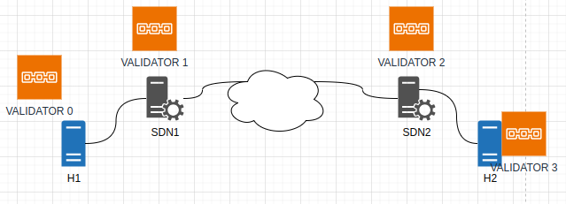
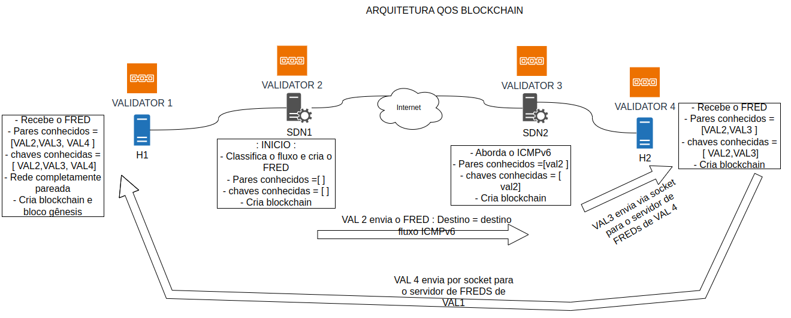

# qosblockchain

* Algumas explicações de design estão em notebook.ipynb

- Arquitetura básica da rede QoSBlockchain

- Arquitetura da troca de mensagens:

<h3>Dependências:</h3>

* Se faltar alguma, provavelmente python vai avisar (olhar as importações do client e do one-container/processor)

* sawtooth-sdk (pip install sawtooth-sdk) (necessário para o client)

* docker

* docker-compose

* toml

* color

* yaml

* pip install sawtooth-signing

* pip install psutil

* copiar https://github.com/hyperledger-archives/sawtooth-sdk-python/blob/main/sawtooth_signing/secp256k1.py para o local onde o pacote sawtooth-signing foi instalado. Se estiver utilizando conda, provavelmente esteja em $HOME/miniconda/envs/!!NOME_AMBIENTE_VIRTUAL_PYTHON!!/lib/python3.8/site-packages/sawtooth_signing/secp256k1.py  --> A versão recuperada pelo pip pode levar a erros !!

* Criar diretorio: sudo mkdir /var/log/sawtooth

* Chaves publica e privada em cada host

<h3> Geração de chaves (hosts) </h3>

* sawtooth keygen my_key

* As chaves .pub e .priv ficam armazenadas em $HOME/.sawtooth/keys/my_key.pub e priv

* Necessário utilizar essas chaves para enviar transações (em redes permissionadas)

<h2> Como interagir (versão atual 1-validador) </h2>

* Criar imagem a partir do on_container/Dockerfile: $ sudo docker build --debug --tag 'qosblockchainv1' .

* Versão atual (folders): one-container e client

* Subir container do Validador (em one-container): sudo python3.8 new_blockchain.py -name qosbcv1 -npairs 0

* Subir o Transaction Processor (em one-container/processor): sudo $HOME/miniconda3/envs/pyfeatures38/bin/python3.8 main.py

* Na proxima versão o Transaction Processor vai ser incluido no mesmo container

* Rodar client apenas quando for enviar transação: reg_qos, list, show

* Client show: mostra um bloco / fluxo dado seu nome

* Client list: mostra todos os blocos da blockchain / ledger

* Client reg_qos --username $nome chave publica criada com sawtooth keygen$

* Client reg_qos: python main_qos_cli.py reg_qos '192.168.0.0-192.168.0.1-5000-5002-tcp' '{"name":"192.168.0.0-192.168.0.1-5000-5002-tcp","state":"Stopped","src_port":"5000","dst_port":"5000","proto":"udp","qos":[],"freds":[]}' --username hostqos

* Client show: python main_qos_cli.py show '192.168.0.0-192.168.0.1-5000-5002-tcp'

* Client list: python main_qos_cli.py list

<h3> Objetivo </h3>

* Criar multiplas blockchain sobre demanda.

* Uma blockchain para cada par de ASs finais (edge/borda da rede)

* Uma blockchain é mantida pelos ASs de borda (2) e por um host final cliente de cada AS.

* Os hosts representam o interesse do consumidor (50%) e os ASs representam o interesse do provedor de serviço de rede (50%)

* A blockchain deve manter os registros de QoS fornecida pela rede e percebida pelos hosts, como um histórico. Com isso, os provedores de rede tem confiança do esforço realizado para fornecer QoS por fluxo, podendo vender QoS como um serviço e gerenciar sua infraestrutura conforme os recursos são utilizados.

* Com a blockchain, os hosts podem monitorar e acompanhar o serviço contratado, observando e contribuindo com o gerenciamento de rede. Assim, podem escolher provedores de rede com base na confiança do serviço fornecido, acompanhar o custo dos serviços de rede sobre demanda e a qualidade empregada para os fluxos de rede das aplicações acessadas.

* A defesa e justificativa devem ser melhoradas. No entanto, existem diversos pontos positivos nessa abordagem.

<h3>Multiplos validadores - pbft</h3>

* Para configurar uma rede blockchain com consenso pbft, são necessários pelo menos 4 nós.

* Para subir o nó validador que gera o bloco gênesis, é necessário que as 4 chaves publicas sejam recebidas. No exemplo (sawtooth-default-pbft.yaml) se utiliza um -> do while para esperar até receber todas as chaves na pasta /pbft-shared/validators/

* Os nós enviam as chaves publicas (geradas por sawadm) que estão armazenadas em /pbft-shared/validators para o nó definido pelo argumento  --peers tcp://validator-0:8800 (endereço do nó gÊnesis:porta da rede)

<h3> Limitações </h3>

* Escalabilidade pode ser um problema (ainda não investigado)

* Algumas portas são exportadas pela blockchain (porta da rede blockchain e porta rest-api são as principais - na versão atual todas as portas são exportadas (consenso, settings ...))

* O número de portas exportadas pode limitar a quantidade de blockchains que podem ser criadas (2 portas exportadas)

* Um número alto de containers pode diminuir o desempenho dos hosts e controladores-SDN (ASs)

* Como atualizar nós que entram depois da rede criada (depois de a blockchain ser povoada -- não investigado)

* Como escolher os nós para posicionar os validadores (blockchain)

* Como os nós encontram os validadores para analisar o QoS das suas aplicações e como descobrem o endereço+porta

* Como configurar as blockchains em tempo-real

* OS hosts não são permanentes, desligam e desconectam -- como manter a consistencia da blockchain com nós "móveis" (trocar de nó leva tempo) --> uma solução é deixar as blockchain nos controladores sdn mas com permissão para os hosts escolhidos poder modificar 

* Os hosts que armazenam o validador (blockchain) precisam armazenar blocos sobre fluxos de outros hosts, é necessario ter um controle além das chaves publica/privada, permitir modificar um fluxo caso os endereços IP e MAC forem consistentes --- (modelo não permissionado)