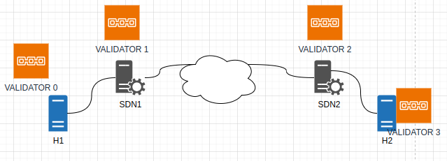
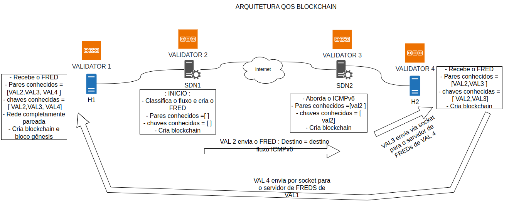

# Guia para teste 01 - 4 validadores - Teste de conectividade e Setup da rede

- Arquitetura básica da rede QoSBlockchain

- Arquitetura da troca de mensagens:

* Na pasta one_container, existe um arquivo chamado docker-compose-modelo.yaml

* Esse arquivo está no formato com as chaves publicas e privadas fixadas. Os validadores compartilham uma pasta onde essas chaves são armazenadas.

* execute sudo docker-compose -f docker-compose-modelo.yaml up -d

<h3>Comandos úteis para observar o funcionamento da blockchain</h3>

* Verificar logs dos containers
    $ sudo docker logs -nome-container-ou-pid

* Verificar saidas dos processos
    $ cat /proc/-numero-pid-/fd/1   ( para sdtin)
    $ cat /proc/-numero-pid-/fd/2   ( para sdtout)

* Verificar comando executado para subir o processo:
    $ cat /proc/-numero-pid-/cmdline

* Verificar o estado de pareamento dos nós (verifica se o rest-api está funcionando corretamente):
    $ curl http://endpoint-rest:porta-rest/peers

* Verificar se existem blocos na blockchain (verifica se o rest-api está se comunicando corretamente com o validador e se este está funcionando):
    $ curl http://endpoint-rest:porta-rest/state?address=87781e
    $ python client/main_qos_cli.py list --url endpoint-rest:porta-rest (ex: 192.168.0.140:8008)

* Acessar um container:
    $ sudo docker exec -it nome-ou-pid bash

* Parar container:
    $ sudo docker container stop nome-container-ou-pid

* Remover container:
    $ sudo docker container rm nome-container-ou-pid

* Verificar portas ativas no host:
    $ ss -lt

* Verificar containers ativos/existentes:
    $ sudo docker ps -a

* Verificar acesso aos containers de dentro de um container - para isso nesse teste existe o container shell:
    $ sudo docker exec -it sawtooth-shell-default bash
